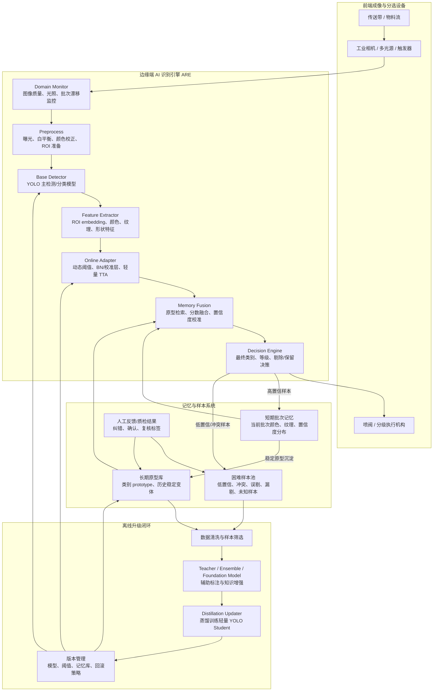

# 精选机/色选机 AI 自适应识别模块方案

日期：2026-06-15  
适用对象：基于 YOLO 系列模型的农产品、珠宝、工业物料在线识别与分选系统

## 1. 背景与目标

现有精选机/色选机 AI 模块以 YOLO 系列模型为核心，主要完成目标检测、缺陷识别、类别判定和喷阀分选控制。实际部署后，物料和成像条件会持续变化：

- 光线、天气、环境温湿度变化；
- 相机曝光、镜头污染、光源衰减；
- 农产品批次、成熟度、含水量、表皮颜色变化；
- 珠宝材质、透明度、切面、高光和反射变化；
- 缺陷形态轻微漂移；
- 某些变化是突发的，某些是缓慢漂移的，也可能具有周期性。

本方案目标是设计一套不依赖频繁人工重训的自适应识别系统：

1. 主模型训练完成后，现场主要执行 test-time adaptation（TTA）或 continual test-time adaptation（CTTA），尽量不频繁重新训练 YOLO 主模型。
2. 增加记忆能力，让系统积累关键特征、类别原型、批次状态、困难样本和人工纠错信息。
3. 在保证工业稳定性的前提下，让系统越用越懂现场物料。
4. 支持后续通过数据蒸馏、周期性模型升级，将现场经验沉淀回模型版本。

核心原则：

> 主模型保持稳定，在线层轻量自适应，记忆库积累经验，蒸馏升级闭环进化。

## 2. 总体架构

建议将 AI 识别模块拆成六个子系统：

### 2.1 系统总览架构图

PNG 文件：`精选机色选机AI自适应识别系统架构图.png`




```text
相机 / 光源 / 传送带
        ↓
图像质量监控与预处理 Domain Monitor
        ↓
YOLO 主检测模型 Base Detector
        ↓
ROI 特征提取 Feature Extractor
        ↓
TTA 在线自适应层 Online Adapter
        ↓
记忆库检索与分数融合 Memory Fusion
        ↓
最终识别 / 分级 / 剔除决策

旁路闭环：
识别日志 → 高置信样本 → 原型记忆库
识别冲突 → 困难样本池
人工纠错 → 校准样本池
周期汇总 → 蒸馏训练 → 新模型版本
```

建议系统模块命名：

```text
ARE: Adaptive Recognition Engine

1. Domain Monitor        环境与批次状态监控
2. Base Detector         YOLO 主识别模型
3. Online Adapter        测试时自适应模块
4. Prototype Memory      类别原型记忆库
5. Hard Sample Buffer    困难样本池
6. Distillation Updater  周期性蒸馏升级器
```

## 3. 模型分层设计

### 3.1 YOLO 主模型

主模型建议负责稳定、实时的检测和初步分类。可选路线：

- 农产品缺陷识别：YOLOv8/YOLOv10/YOLO11/YOLOv12 系列检测模型；
- 小缺陷或微小异物：YOLO + 高分辨率 ROI 分类器；
- 珠宝识别：YOLO 检测定位 + ROI 多分支分类器；
- 新品类和开放类别辅助：YOLO-World 或 Grounding DINO 作为辅助模型，不建议直接控制喷阀。

模型输出不应只包含框和类别，建议输出：

```text
bbox
class_id
confidence
object_feature
color_feature
texture_feature
shape_feature
quality_score
domain_state
```

其中 `object_feature` 用于记忆库检索，`domain_state` 用于判断当前是否需要自适应。

### 3.2 ROI 特征模型

对每个 YOLO 检出的目标裁剪 ROI，再提取 embedding。可选方案：

1. 直接复用 YOLO backbone/neck 的中间特征；
2. 增加一个轻量 ROI encoder；
3. 对珠宝等复杂纹理目标，使用专门训练的 metric learning encoder；
4. 离线研发阶段可用 DINOv2/CLIP/SigLIP 等基础视觉模型提特征，线上蒸馏成轻量 encoder。

建议每个目标生成多模态特征：

```text
embedding_vector: 256/512 维
HSV/Lab color histogram
texture descriptor
shape descriptor
area / aspect ratio / roundness
local defect heatmap summary
```

## 4. Test-Time Adaptation 设计

### 4.1 为什么不用现场频繁重训

现场全量重训存在风险：

- 需要标注，操作成本高；
- 可能因为短时间异常批次导致模型学偏；
- 难以保证工业现场稳定性；
- 模型版本不可控，不利于售后定位问题；
- 边缘设备训练资源有限。

因此建议现场只做轻量 TTA：

```text
冻结主模型大部分参数
只更新统计量、阈值、校准层、adapter、prototype 或 memory
所有在线更新必须可回滚
```

### 4.2 TTA 等级划分

#### L0：无权重自适应，第一阶段优先落地

不更新模型参数，只更新外部状态：

- 自动曝光/白平衡/颜色校正；
- 图像亮度、对比度、清晰度质量监控；
- 当前批次颜色分布统计；
- 类别置信度分布统计；
- 类别动态阈值；
- 记忆库原型检索；
- 分数融合校准。

优点：风险最低，适合先上线。

#### L1：只更新归一化统计和校准参数

可更新：

- BatchNorm running mean / variance；
- 分类头 temperature；
- per-class bias；
- confidence calibration layer；
- 小型 adapter。

不建议更新：

- YOLO backbone 主干；
- neck 大量卷积层；
- 检测头全部参数。

这一层适合应对光照、曝光、背景、相机状态变化。

#### L2：Teacher-Student 在线自适应

结构：

```text
Teacher 模型：EMA 更新，负责生成稳定伪标签
Student 模型：轻量更新 adapter/BN/calibration
Memory：保存高置信历史实例，修正伪标签质量
```

关键机制：

- 强弱增强一致性；
- 高置信伪标签筛选；
- 类别自适应阈值；
- 错误累积监控；
- 参数回滚；
- 原始模型锚定。

适合现场长期运行，但必须加防漂移保护。

#### L3：离线周期性再训练/蒸馏

不是实时在线训练，而是服务端或维护端执行：

```text
高置信样本 + 困难样本 + 人工纠错样本 + 新批次代表样本
        ↓
Teacher / Ensemble / Foundation Model 辅助标注
        ↓
数据清洗和蒸馏
        ↓
训练轻量 YOLO Student
        ↓
灰度发布新模型版本
```

## 5. 记忆库设计

### 5.1 三层记忆

#### 短期记忆：当前批次记忆

保存最近几分钟到几小时的高置信样本。

用途：

- 适应当前物料批次；
- 估计当前正常物料颜色、大小、纹理分布；
- 调整类别阈值；
- 识别短期环境变化。

建议字段：

```text
material_id
class_id
feature_center
color_center
texture_center
shape_stats
confidence_mean
sample_count
time_window
camera_state
```

#### 长期记忆：跨批次类别原型库

保存历史稳定出现过的类别原型。

```text
prototype_id
class_id
material_type
feature_vector
color_histogram
texture_descriptor
shape_descriptor
camera_condition
sample_count
trust_score
last_update_time
last_used_time
source: model_high_conf / human_confirmed / distilled
```

作用：

- 对 YOLO 低置信结果进行辅助判断；
- 识别历史上见过的物料变体；
- 支持客户现场个性化经验积累；
- 为后续蒸馏训练提供代表样本。

#### 异常记忆：困难样本池

保存以下样本：

- 低置信；
- 多类别分数接近；
- YOLO 与记忆库判断冲突；
- 时序结果不一致；
- 人工纠错；
- 误剔样本；
- 漏剔样本；
- 新物料或未知缺陷。

困难样本池不直接参与在线自动学习，优先用于人工复核和后续蒸馏。

### 5.2 记忆库更新门控

为了避免系统越学越错，必须设置严格门控。

#### 高置信门控

只有满足条件才进入自动记忆：

```text
YOLO confidence > T_class
prototype similarity > S_class
image_quality_score > Q_min
domain_shift_score < D_max
recent_conflict_rate < C_max
```

#### 多帧/短窗口一致性

连续窗口内类别分布稳定，才允许批量更新原型。

#### 类别平衡

防止单一批次大量覆盖长期记忆。长期记忆要保留多样性：

```text
每个类别最多 K 个原型
每个批次最多写入 N 个原型
相似原型合并
罕见但人工确认的原型保留
```

#### 人工反馈优先级

记忆可信度排序：

```text
人工确认样本 > 多模型一致高置信样本 > 单模型高置信样本 > 记忆库推断样本
```

## 6. 推理流程

单个目标的在线推理流程：

```text
1. 图像质量检测
2. YOLO 检测目标
3. 裁剪 ROI
4. 提取 embedding/color/texture/shape 特征
5. 查询短期批次记忆
6. 查询长期类别原型库
7. 计算 domain shift score
8. 进行类别动态阈值修正
9. 融合 YOLO 分数、原型相似度、批次先验和图像质量
10. 输出最终类别、置信度、剔除等级
11. 高置信样本进入记忆候选池
12. 冲突/低置信样本进入困难样本池
```

初期可以使用可解释的线性融合：

```text
final_score =
  0.60 * yolo_score
+ 0.20 * long_memory_similarity
+ 0.10 * short_batch_similarity
+ 0.05 * class_prior_score
+ 0.05 * image_quality_correction
```

后续可以训练一个小型 meta-classifier：

```text
input:
  yolo_score
  top2_score_gap
  prototype_similarity
  batch_similarity
  image_quality_score
  domain_shift_score
  object_size
  color_distance
  texture_distance

output:
  calibrated_class_probability
  reject_or_accept_decision
```

## 7. 自适应触发机制

不是每一帧都需要更新。建议设置 Domain Monitor：

```text
brightness_shift
color_temperature_shift
blur_score
background_shift
object_color_distribution_shift
class_confidence_distribution_shift
prototype_distance_shift
unknown_rate
conflict_rate
```

触发规则：

```text
轻微变化：
  只更新短期统计和阈值

持续变化：
  更新 BN/adapter/calibration

明显异常：
  暂停在线学习，只进入保守推理模式

未知物料：
  启用开放词汇辅助模型或人工确认流程
```

## 8. 防漂移和安全机制

工业设备必须优先稳定。建议内置以下保护：

1. 原始模型锚定：任何在线模型都保留 base model 副本。
2. 参数白名单：只允许更新 BN、adapter、temperature、bias、prototype。
3. 更新限幅：每次更新幅度不能超过阈值。
4. 回滚机制：当误剔率、低置信率、冲突率异常时回滚。
5. 影子评估：在线更新后的模型先作为 shadow model 运行，观察稳定后再接管。
6. 记忆库版本化：每次写入 memory DB 都有版本，可恢复。
7. 人工确认优先：客户反馈样本不能被自动记忆覆盖。
8. 异常批次隔离：某一批次的统计不直接污染长期原型库。

建议运行模式：

```text
Normal Mode       正常模式
Adaptive Mode     自适应模式
Conservative Mode 保守模式
Review Mode       人工复核模式
Rollback Mode     回滚模式
```

## 9. 农产品与珠宝的差异化策略

### 9.1 农产品

主要变化：

- 批次颜色差异；
- 成熟度和含水量；
- 表皮纹理；
- 霉变、破损、虫蛀、黑点；
- 小异物和杂质；
- 背景和传送带污染。

推荐策略：

- 短期批次记忆权重更高；
- 使用 Lab/HSV 颜色空间统计；
- 正常样本原型要覆盖多个成熟度阶段；
- 缺陷样本要建立细粒度原型；
- 重点保存边界样本，如轻微霉变、轻微破损。

### 9.2 珠宝

主要变化：

- 高反光；
- 透明和半透明；
- 切面角度；
- 光源方向；
- 材质差异；
- 微小瑕疵。

推荐策略：

- 长期原型库权重更高；
- 增加多角度或多光源输入；
- 特征中加入高光区域、边缘、切面几何；
- 对 ROI 分类器使用 metric learning；
- 可用开放词汇模型辅助发现新类别，但喷阀决策仍由闭集模型和记忆库控制。

## 10. 工程实现建议

### 10.1 边缘端组件

```text
inference_service
  - yolo_engine
  - roi_feature_engine
  - domain_monitor
  - online_adapter
  - memory_retriever
  - decision_fusion
  - sample_logger

memory_service
  - short_term_memory
  - long_term_prototype_db
  - hard_sample_buffer
  - version_manager

ops_service
  - model_version_manager
  - rollback_manager
  - telemetry_uploader
  - human_feedback_importer
```

### 10.2 存储方案

轻量实现：

- SQLite 保存元数据；
- FAISS/HNSW 保存向量索引；
- 本地文件系统保存 ROI 图片；
- JSON/YAML 保存阈值和版本配置。

中大型部署：

- PostgreSQL 保存元数据；
- Milvus/Qdrant 保存向量；
- MinIO/NAS 保存样本；
- Grafana/Prometheus 监控指标。

### 10.3 关键日志

每个目标建议记录：

```text
timestamp
machine_id
camera_id
material_id
batch_id
image_quality
yolo_class
yolo_score
final_class
final_score
memory_top1_class
memory_top1_similarity
domain_shift_score
decision
adapter_version
memory_version
model_version
```

这些日志是售后定位、模型升级和客户效果评估的核心资产。

## 11. 指标体系

离线指标：

- mAP；
- precision / recall；
- F1；
- per-class AP；
- 小目标召回率；
- 缺陷召回率；
- 正常样本误剔率；
- 低置信样本比例。

在线指标：

- 误剔率；
- 漏剔率；
- 喷阀触发稳定性；
- 当前批次低置信比例；
- 记忆库命中率；
- YOLO 与 memory 冲突率；
- TTA 更新次数；
- 回滚次数；
- 每小时新增困难样本数。

业务指标：

- 成品纯度；
- 带出比；
- 产能；
- 客户人工复检量；
- 换批次后的稳定时间；
- 新物料适应时间。

## 12. 分阶段落地路线

### 阶段 1：稳定版自适应，不改模型权重

周期：2-4 周

交付：

- 图像质量监控；
- 动态阈值；
- 批次统计；
- 高置信样本记录；
- 困难样本池；
- 基础报表。

目标：

- 提升换批次和光照变化下的稳定性；
- 建立后续记忆库的数据基础。

### 阶段 2：原型记忆库

周期：4-8 周

交付：

- ROI embedding；
- 短期记忆；
- 长期 prototype memory；
- FAISS/HNSW 检索；
- YOLO + memory 分数融合；
- 记忆库版本化。

目标：

- 让系统能够利用历史经验修正边界样本；
- 减少低置信和轻微 domain shift 导致的误判。

### 阶段 3：轻量 TTA

周期：6-10 周

交付：

- BN/adapter/calibration 在线更新；
- teacher-student EMA；
- 类别自适应伪标签阈值；
- 防漂移回滚；
- shadow model 评估。

目标：

- 支持连续漂移和周期性变化；
- 在不全量重训的情况下提升长期运行表现。

### 阶段 4：蒸馏升级闭环

周期：长期迭代

交付：

- 人工纠错工具；
- 困难样本主动学习；
- foundation model 辅助标注；
- Teacher ensemble；
- 轻量 YOLO student 蒸馏；
- 模型灰度发布和回滚。

目标：

- 将现场经验沉淀为新模型版本；
- 支持客户和物料个性化。

## 13. 推荐技术组合

第一版推荐组合：

```text
YOLO 主模型：
  YOLOv8/YOLO11/YOLOv12，依据现有工程栈选择

ROI 特征：
  复用 YOLO 中间层 + 轻量 projection head

记忆库：
  FAISS + SQLite

在线自适应：
  动态阈值 + BN 统计更新 + temperature calibration

风险控制：
  高置信门控 + 多帧一致性 + 版本回滚

蒸馏：
  周期性离线执行，不在设备实时全量训练
```

增强版推荐组合：

```text
检测：
  YOLO 主模型 + YOLO-World/Grounding DINO 辅助发现未知类

TTA：
  Mean Teacher + adaptive pseudo-label threshold + adapter update

Memory：
  short-term memory + long-term prototypes + hard sample buffer

蒸馏：
  Teacher ensemble / foundation model → edge YOLO student
```

## 14. 与本项目密切相关的论文和技术

### 14.1 YOLO 与农业/工业检测

1. Badgujar et al., 2024, **Agricultural Object Detection with YOLO Algorithm: A Bibliometric and Systematic Literature Review**  
   链接：https://arxiv.org/abs/2401.10379  
   相关性：总结 YOLO 在农业目标检测中的应用、部署和改进方向，适合作为农产品场景综述。

2. Cheng et al., 2024, **YOLO-World: Real-Time Open-Vocabulary Object Detection**  
   链接：https://arxiv.org/abs/2401.17270  
   相关性：YOLO 体系与视觉语言开放词汇检测结合，可用于新物料、新缺陷发现或人工标注辅助。

3. Liu et al., 2024, **YOLO-UniOW: Efficient Universal Open-World Object Detection**  
   链接：https://arxiv.org/abs/2412.20645  
   相关性：开放世界 YOLO，可将未知物体作为 unknown 处理，适合未知异物、新珠宝品类等场景。

4. Zuo et al., 2024, **HyperDefect-YOLO: Enhance YOLO with HyperGraph Computation for Industrial Defect Detection**  
   链接：https://arxiv.org/abs/2412.03969  
   相关性：面向工业缺陷检测的 YOLO 增强，关注复杂背景、多尺度缺陷和特征关系建模。

5. Qi et al., 2024, **Detecting and Classifying Defective Products in Images Using YOLO**  
   链接：https://arxiv.org/abs/2412.16935  
   相关性：工业产品缺陷检测中的 YOLO 实践参考。

### 14.2 Test-Time Adaptation 基础方法

6. Wang et al., 2020, **Tent: Fully Test-time Adaptation by Entropy Minimization**  
   链接：https://arxiv.org/abs/2006.10726  
   相关性：TTA 经典方法，通过测试时熵最小化和归一化层参数更新实现自适应，是在线轻量更新的基础思想。

7. Wang et al., 2022, **Continual Test-Time Domain Adaptation (CoTTA)**  
   链接：https://arxiv.org/abs/2203.13591  
   相关性：面向连续变化环境，提出 teacher 平均预测和随机恢复机制，适合本项目的长期漂移场景。

8. Lyu et al., 2024, **Variational Continual Test-Time Adaptation**  
   链接：https://arxiv.org/abs/2402.08182  
   相关性：用不确定性缓解 CTTA 中的 prior drift，可借鉴其不确定性监控思想。

9. Kerssies et al., 2022, **Evaluating Continual Test-Time Adaptation for Contextual and Semantic Domain Shifts**  
   链接：https://arxiv.org/abs/2208.08767  
   相关性：指出 BN 类方法在实际 shift 中很稳，Tent 适合短期，CoTTA 适合长期；对工程选型有参考价值。

### 14.3 目标检测的 SFDA / TTA / CTTA

10. Cao et al., 2024, **Exploring Test-Time Adaptation for Object Detection in Continually Changing Environments (AMROD)**  
    链接：https://arxiv.org/abs/2406.16439  
    相关性：直接针对目标检测的 CTTA，包含对象级对比学习、自适应监控、类别动态阈值和防遗忘恢复机制，和本项目高度相关。

11. Varailhon et al., 2024, **Source-Free Domain Adaptation for YOLO Object Detection (SF-YOLO)**  
    链接：https://arxiv.org/abs/2409.16538  
    相关性：直接针对 YOLO 的 source-free domain adaptation，使用 teacher-student 和目标域增强，适合作为 YOLO 在线/半在线适应参考。

12. Hao et al., 2024, **Simplifying Source-Free Domain Adaptation for Object Detection**  
    链接：https://arxiv.org/abs/2407.07586  
    相关性：强调 BN 统计更新、简单 teacher-student 和固定伪标签也能取得强效果，工程上非常值得参考。

13. Zhang and Chou, 2024, **Source-free Domain Adaptation for Video Object Detection Under Adverse Image Conditions**  
    链接：https://arxiv.org/abs/2404.15252  
    相关性：视频检测在噪声、湍流、雾等恶劣条件下的 SFDA，适合参考色选机连续流图像和恶劣成像条件。

14. Gao et al., 2025, **Test-Time Adaptive Object Detection with Foundation Model**  
    链接：https://arxiv.org/abs/2510.25175  
    相关性：提出多模态 prompt mean-teacher 和 Instance Dynamic Memory，记忆高质量伪标签实例；与本方案的动态实例记忆库非常接近。

15. Belal et al., 2025, **VLOD-TTA: Test-Time Adaptation of Vision-Language Object Detectors**  
    链接：https://arxiv.org/abs/2510.00458  
    相关性：面向 YOLO-World/Grounding DINO 等视觉语言检测器的 TTA，使用 IoU 加权熵和图像条件 prompt 选择，可作为开放词汇辅助模型的自适应参考。

16. Zhou et al., 2025, **Bayesian Test-time Adaptation for Object Recognition and Detection with Vision-language Models**  
    链接：https://arxiv.org/abs/2510.02750  
    相关性：使用动态 cache 保存类别 embedding、空间尺度和类别先验，无需反向传播；适合边缘设备低风险自适应。

### 14.4 开放集/未知类辅助

17. Liu et al., 2023, **Grounding DINO: Marrying DINO with Grounded Pre-Training for Open-Set Object Detection**  
    链接：https://arxiv.org/abs/2303.05499  
    相关性：开放集检测经典方法，可用于新类别、新缺陷、未知异物的辅助标注和研发分析。

18. Ren et al., 2024, **Grounding DINO 1.5: Advance the Edge of Open-Set Object Detection**  
    链接：https://arxiv.org/abs/2405.10300  
    相关性：包含 Edge 版本，面向边缘部署，适合作为离线标注或现场辅助识别参考。

### 14.5 与记忆库/缓存相关的 TTA 思想

19. Cao et al., 2025, **Noisy Test-Time Adaptation in Vision-Language Models**  
    链接：https://arxiv.org/abs/2502.14604  
    相关性：强调开放世界中 noisy/OOD 样本会损害 TTA，支持本方案中“异常样本不直接学习，先进入困难样本池”的设计。

20. Kim, 2025, **Ultra-Light Test-Time Adaptation for Vision-Language Models**  
    链接：https://arxiv.org/abs/2511.09101  
    相关性：冻结 backbone，只更新类别原型、类别先验和温度，思想非常适合工业边缘设备的安全自适应。

## 15. 推荐研读顺序

第一批，直接指导工程落地：

1. AMROD：目标检测 CTTA，重点看 adaptive monitoring、类别动态阈值和防遗忘。
2. SF-YOLO：YOLO 的 source-free adaptation，重点看 teacher-student 稳定伪标签。
3. Simplifying SFOD：重点看 BN 统计更新和简单自训练策略。
4. Tent / CoTTA：理解 TTA 和 CTTA 的基本机制。

第二批，指导记忆库和开放类别：

5. Test-Time Adaptive Object Detection with Foundation Model：重点看 Instance Dynamic Memory。
6. BCA+：重点看 dynamic cache、class prior、training-free adaptation。
7. YOLO-World：用于开放词汇辅助识别。
8. Grounding DINO / Grounding DINO 1.5：用于辅助标注、新类别发现。

第三批，指导行业应用：

9. Agricultural Object Detection with YOLO Review。
10. HyperDefect-YOLO。
11. YOLO-UniOW。

## 16. 风险与注意事项

1. TTA 不是万能的。若物料类别真的变化很大，仍需要人工确认或离线升级。
2. 记忆库不能无门槛自动写入，否则会出现确认偏差。
3. 现场自适应必须可关闭、可回滚、可追踪。
4. 边缘设备上不要引入过重的 foundation model 作为实时主控。
5. 开放词汇模型适合做辅助发现、标注建议和低频复核，不建议直接控制喷阀。
6. 对高价值珠宝场景，要优先控制漏检风险；对大产量农产品场景，要同时关注误剔率和产能。

## 17. 结论

本项目最适合的技术路线是：

```text
稳定 YOLO 主模型
+ 图像质量与批次状态监控
+ 动态阈值与轻量 TTA
+ 短期批次记忆
+ 长期类别原型库
+ 困难样本池
+ 周期性蒸馏升级
```

这条路线兼顾工业稳定性、实时性、可解释性和持续进化能力。短期可以先做不改权重的自适应和记忆库；中期引入 BN/adapter/teacher-student；长期通过蒸馏和模型版本管理形成真正的“越用越聪明”的精选机/色选机 AI 系统。
